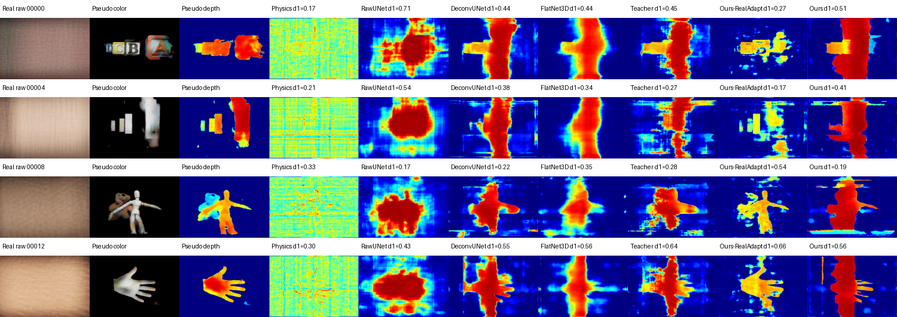

# Manuscript: Lensless Depth Diffusion

## Metadata

- Project ID: `lensless-depth-diffusion`
- Working title: Physics-Guided Depth Estimation for PSF-Stack Lensless Imaging
- Target format: final graphics project report, short conference-paper style
- Status: manuscript and poster updated with `Ours / Proposed` full-test metrics, rebuilt architecture figure, explicit real-capture validation table, and real-adaptive deconvolution diagnostic
- Current PDF export: `exports/main-prelim-2026-06-04.pdf`
- HTML archive: `https://donggeonbae.github.io/writing/projects/lensless-depth-diffusion-manuscript-status/`
- Canonical live status: `https://donggeonbae.github.io/research/projects/lensless-depth-diffusion-final-model-status/`

## Core Claim

PSF-stack deconvolution provides depth-dependent focus evidence. The final `Ours / Proposed` model places that physics inside latent diffusion reverse sampling through a learnable PSF-Wiener bank, clean-depth decoding, focus-likelihood evaluation, and latent correction at each reverse step.

## Final Method Text

The manuscript should describe `Ours / Proposed` compactly:

- Synthetic lensless measurement from RGB, depth, and a 42-plane PSF stack.
- PSF-stack Wiener deconvolution and focus-posterior features.
- Latent depth VAE encoder/decoder.
- Conditional latent denoising U-Net.
- Clean-posterior focus likelihood inside reverse diffusion.
- Latent correction before the DDIM transition.
- Depth-guided RGB fusion from deconvolution planes.

Avoid describing the method as only `deconv + UNet`. The supervised teacher is an upper-bound baseline, not `Ours`.

## Final Results

| Method | fg delta1 | fg delta2 | fg delta3 | fg MAE |
| --- | ---: | ---: | ---: | ---: |
| Physics-only focus/deconv | 0.391 | 0.617 | 0.816 | 0.214 |
| Raw U-Net, 66k | 0.436 | 0.629 | 0.753 | 0.204 |
| FlatNet3D-style, 66k | 0.823 | 0.908 | 0.939 | 0.069 |
| Deconv U-Net, 66k | 0.865 | 0.926 | 0.949 | 0.050 |
| Earlier integrated LDM | 0.878 | 0.927 | 0.948 | 0.059 |
| **Ours / Proposed** | **0.896** | **0.922** | **0.932** | **0.050** |
| Teacher + affine | 0.885 | 0.946 | 0.971 | 0.041 |

Final interpretation:

- `Ours / Proposed` is selected because it satisfies the inverse-problem diffusion policy.
- It improves strict depth and visual denoising but trails supervised and guided baselines on loose delta3.
- The 98% target is not reached.

## Real-Capture Diagnostic

| Split | Samples | Physics focus MAE / d1 / d3 | Diffusion Ours MAE / d1 / d3 | Ours-RealAdapt MAE / d1 / d3 |
| --- | ---: | ---: | ---: | ---: |
| 20250505 real validation | 20 | 0.230 / 0.294 / 0.852 | 0.365 / 0.337 / 0.639 | 0.264 / 0.382 / 0.648 |
| 20250527 real subset | 32 | 0.291 / 0.218 / 0.662 | 0.419 / 0.198 / 0.390 | 0.177 / 0.363 / 0.692 |

These values use pseudo-depth labels only. `Ours-RealAdapt` is a diagnostic branch showing that measured captures need learnable deconvolution, not a replacement for the final diffusion model.

## Figure Set

| Figure | Manuscript role | Current status |
| --- | --- | --- |
| Architecture | Method overview | Rebuilt as deterministic figure with real PSF/raw/RGB/depth/deconv/focus/depth/output insets, real-validation diagnostic inset, and visible latent encoder/decoder |
| Deconvolution focus planes | Physics evidence | Uses `z={14,22,30,38}`; excludes weak early planes |
| Depth results | Qualitative comparison | Shows RGB, GT depth, physics baseline, and `Ours`; teacher/error omitted |
| Real-data comparison | Domain-gap diagnostic | Shows pseudo labels, learned baselines, `Ours-RealAdapt`, and diffusion `Ours` |

## Discussion Points

- The deconvolution volume is the strongest representation across all non-diffusion and diffusion variants.
- `Ours / Proposed` is methodologically correct for the project objective, but not SOTA on this dataset.
- The current gap is mainly calibration and boundary ambiguity.
- Real captures require learnable inverse filtering and exposure/PSF calibration.

## Verification Status

- Final full-6k diffusion evaluation completed across 4 GPU shards.
- Paper and poster now use the final `Ours / Proposed` aggregate.
- Architecture figure has been replaced in the paper, poster, and figure archive, with validation-only RealAdapt shown explicitly.
- Final PDFs and encrypted HTML pages have been rebuilt after the latest text and metric update.
